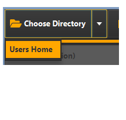
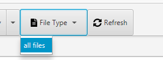
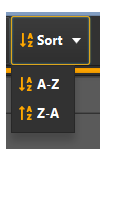
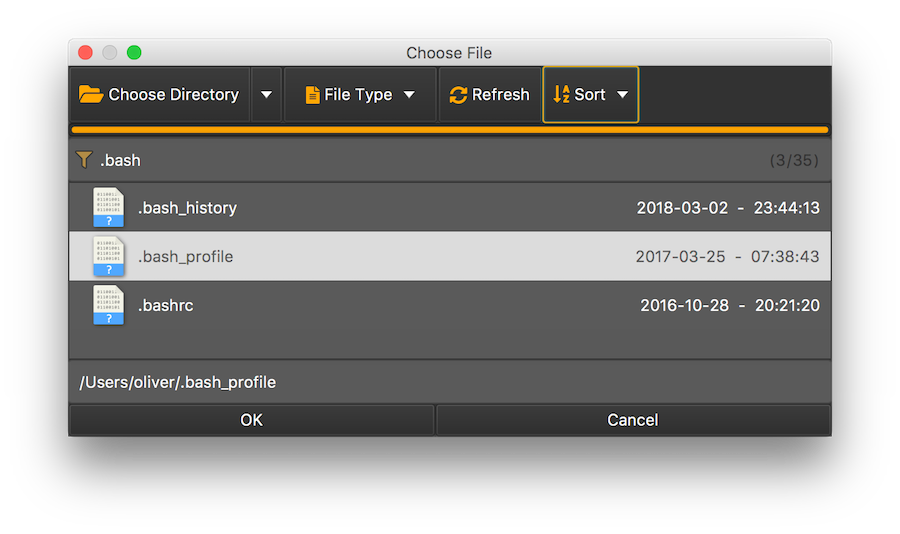
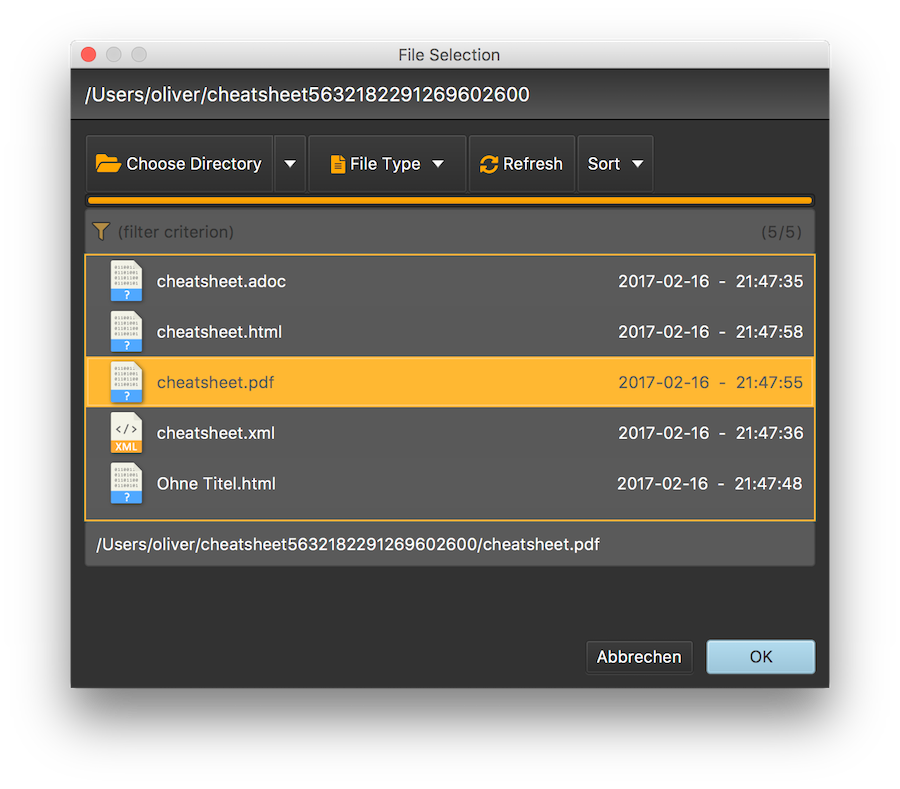

# FXFileChooser

[](https://opensource.org/licenses/Apache-2.0) [](https://javadoc.io/doc/net.raumzeitfalle.fx/filechooser/0.0.11)  [](https://sonarcloud.io/dashboard?id=net.raumzeitfalle.fx%3Afilechooser) [](https://codecov.io/gh/Oliver-Loeffler/FXFileChooser) [](https://maven-badges.herokuapp.com/maven-central/net.raumzeitfalle.fx/filechooser)

[](https://github.com/Oliver-Loeffler/FXFileChooser/actions/workflows/verify-windows.yml)
[](https://github.com/Oliver-Loeffler/FXFileChooser/actions/workflows/verify-macos.yml)

Custom JavaFX file chooser which allows quick manual filtering, which allows to add Path predicates as filter and which is testable using TestFX.

As the standard JavaFX file chooser uses system dialogs, so it is hard to test and hard to modify (e.g. new Skin). In some cases the system controls even show poor performance opening folders with many files (depends on operating system and JRE version).

On Microsoft Windows platforms running with Java 8, I've encountered cases where it was impossible to use the Java Swing JFileChooser, simply due to the high number of files in a directory. Using the JavaFX FileChooser was also not an option as I required a simplistic way to filter the files by name.

## Licensing and attributions

See `LICENSE` and `NOTICE` for details. The project is licensed using the Apache License, Version 2.0 
and attributes to FontAwesome Free 5.01 (Font Awesome Free License and CC BY 4.0 license).

## Adding FXFileChooser to your Maven or Gradle project

### Dependency for Maven `POM.xml` for JDK17+

```xml
<dependency>
  <groupId>net.raumzeitfalle.fx</groupId>
  <artifactId>filechooser</artifactId>
  <version>0.0.11</version>
</dependency>
```
### Dependency for Gradle `build.gradle`

```Groovy
implementation 'net.raumzeitfalle.fx:filechooser:0.0.11'
```

When using FXFileChooser in a modular Java project, then add following statement to your module-info:

```java
module your.module {
    requires net.raumzeitfalle.fxfilechooser;
}
```

Besides version `0.0.9` which is primarily intended for Java 8, there is version `0.0.10` which exists for a variety of Java/OpenJFX combinations.
Those are not fully tested so please feel free to provide some feedback.

| Java | JavaFX | artifact version |
|-|--------|------------------|
| 8      | 8      | `0.0.9`          |
| 9      | 9      | `0.0.10-jdk9`    |
| 11     | 11.0.1 | `0.0.10-jdk11`   |
| 11     | 16     | `0.0.10-jdk16`   |
| 17     | 17.0.2 | `0.0.10-jdk17`   |
| 17     | 18.0.2 | `0.0.10-jfx18`   |
| 17     | 19     | `0.0.10-jfx19`   |
| 17     | 19     | `0.0.11`         |
| 17     | 20     | `0.0.12`         |

All packages are available on https://search.maven.org/artifact/net.raumzeitfalle.fx/filechooser.
Java 17 will be baseline for development from now on. However, backport of working features to Java 11 is thinkable.

Java-11 (LTS) with OpenJFX11:
```xml
<dependency>
  <groupId>net.raumzeitfalle.fx</groupId>
  <artifactId>filechooser</artifactId>
  <version>0.0.10-jdk11</version>
</dependency>
```

Java-17 (LTS) with OpenJFX17:
```xml
<dependency>
  <groupId>net.raumzeitfalle.fx</groupId>
  <artifactId>filechooser</artifactId>
  <version>0.0.12</version>
</dependency>
```

## How to build it

This project requires Java-17 or later and utilizes JavaFX 17 or later.
The build is setup using Maven. As publishing to http://search.maven.org requires signing, the Maven build is configured to sign the artifacts durin verify phase. This may cause problems when the GPG signing is no properly setup. Hence Maven profile exists, which skips the signing step.

Following steps are needed to get the code and run the tests:

```shell
git clone https://github.com/Oliver-Loeffler/FXFileChooser.git
cd FXFileChooser

# Run all tests
mvn verify -P github

# Install the artifact locally (tests ran already during verify)
mvn install -P github -DskipTests=true
```

The deployment is controlled using `maven-release-plugin`.

## How it works

FXFileChooser provides access to a DirectoryChooser and a ListView populated with files in the selected directory. The process starts in the users home directory. The ListView is populated by a background service running an update task upon request. 

Once the ListView is populated with Path items, those are filtered by the String entered in the filter TextField. The filter condition is "contains" whereas special characters such as ` '"','?','<','>','|',':','*'` are removed.

It turned out that with slow network connections the experience is great when using a single stream and updating the ListView in the streams forEach method. However, this can still take some seconds.

**Ideas**
 1. Provide some kind of directory content pre fetching for large network shares. 
 2. Indicate update progress and update ListView with one operation (one single update works fine, in case of using pre fetching that would be okay). Otherwise one would see an empty List and would have to wait.
 3. In the above case, ensure that files which are selected but do not exist are removed from view on selection or hover OR dont accept the OK action in case the file does no longer exist and trigger update then.  
 4. Update the view in one step (one single update works fine, in case of using pre fetching that would be okay). But then also update only what has changed. Never clear the list, only remove items which do no longer exist and add items which are not in the view.
 5. Keep the selection (if file still exists after update)


## Available versions

 * FileChooser placed in a customized JavaFX stage
 * One placed in a JavaFX dialog
 * One placed in a JFXPanel, so it can be used in Java Swing applications.


## Features & Ideas
 
 * FXFileChooser is based on FXML and CSS and so fully customizable (the ListView might be replaced by a TableView to have more options in terms of sorting - or it will be completely exchangeable - I'll see)
 * Icons are realized as SVGPaths based upon FontAwesome Free 5 (no glyphs, no extra dependencies, the SVGPaths are part of the FXML)
 * The choose directory button provides a menu, where default locations (or a history of locations) can be provided. **(tbd.)**
 *  File types can be selected from filters **(tbd.)**
 
   
 * add sorting by name or time
 * consider using a TableView instead a plain list
 * consider regular expression support for filtering

**Ideas**
 * A nice build script.
 * A great skin (CSS) is desirable (well I just got inspired by https://github.com/angelicalleite/museuid and will see :-).


Tests are missing and currently I'm playing with TestFX - but it's not yet working as I like it.


## Using the FileChooser with Swing

```java
import java.awt.FlowLayout;

import javax.swing.JButton;
import javax.swing.JFrame;
import javax.swing.JOptionPane;

import net.raumzeitfalle.fx.filechooser.Skin;
import net.raumzeitfalle.fx.filechooser.SwingFileChooser;

public class DemoSwing {
    public static void main(String... args) {

        JFrame frame = new JFrame("Window");
        frame.setDefaultCloseOperation(JFrame.EXIT_ON_CLOSE);
        frame.setLayout(new FlowLayout(FlowLayout.LEFT));
        JButton showDialogButton = new JButton("show SwingFileChooser");
        frame.getContentPane().add(showDialogButton);

        // SwingFileChooser.setUseJavaFxDirectoryChooser(true);
        SwingFileChooser fileChooser = SwingFileChooser.create(Skin.DARK);
        showDialogButton.addActionListener(l -> {
            int option = fileChooser.showOpenDialog(frame);
            if (option == SwingFileChooser.APPROVE_OPTION) {
                JOptionPane.showMessageDialog(frame, fileChooser.getSelectedFile().toString());
            }
        });

        frame.pack();
        frame.setVisible(true);
    }
}
```




## Using the JavaFX Dialog version

```java
import java.nio.file.Path;

import javafx.application.Application;
import javafx.scene.Scene;
import javafx.scene.control.Alert;
import javafx.scene.control.Button;
import javafx.stage.Stage;
import net.raumzeitfalle.fx.filechooser.FXFileChooserDialog;
import net.raumzeitfalle.fx.filechooser.Skin;

public class DemoFxDialog extends Application {
    public static void main(String[] args) {
        Application.launch();
    }

    @Override
    public void start(Stage primaryStage) throws Exception {
        Button button = new Button("Show File Chooser");
        FXFileChooserDialog dialog = FXFileChooserDialog.create(Skin.DARK);
        button.setOnAction(evt -> dialog.showOpenDialog(primaryStage).ifPresent(this::showSelection));

        Scene scene = new Scene(button);
        primaryStage.setScene(scene);
        primaryStage.setTitle("Demo");
        primaryStage.show();
    }

    private void showSelection(Path selectedPath) {
        Alert alert = new Alert(Alert.AlertType.INFORMATION);
        alert.setHeaderText("File Selection");
        alert.setContentText(selectedPath.toString());
        alert.show();
    }
}
```




## A customizable version with its own stage

```java
import javafx.application.Application;
import javafx.scene.Scene;
import javafx.scene.control.Alert;
import javafx.scene.control.Button;
import javafx.stage.Stage;
import net.raumzeitfalle.fx.filechooser.FXFileChooserStage;
import net.raumzeitfalle.fx.filechooser.Skin;

import java.nio.file.Path;

public class DemoFxStage extends Application {
    public static void main(String[] args) {
        Application.launch();
    }

    @Override
    public void start(Stage primaryStage) throws Exception {
        Button button = new Button("Show File Chooser");
        FXFileChooserStage fc = FXFileChooserStage.create(Skin.DARK);
        button.setOnAction(evt -> fc.showOpenDialog(primaryStage)
                                    .ifPresent(this::showSelection));

        Scene scene = new Scene(button);
        primaryStage.setScene(scene);
        primaryStage.setTitle("Demo");
        primaryStage.show();
    }

    private void showSelection(Path selectedPath) {
        Alert alert = new Alert(Alert.AlertType.INFORMATION);
        alert.setHeaderText("File Selection");
        alert.setContentText(selectedPath.toString());
        alert.show();
    }
}
```


## Using FileChooser as a control

As with version `0.0.9` the FileChooser can be used as a control within any scene. There is no need to have a separate window anymore. However, functionality is not yet finalized. Feel free to experiment. I'm looking forward to your feedback.

```java
import javafx.application.Application;
import javafx.scene.Scene;
import javafx.stage.Stage;
import net.raumzeitfalle.fx.filechooser.DirectoryChooserOption;
import net.raumzeitfalle.fx.filechooser.FileChooser;
import net.raumzeitfalle.fx.filechooser.Skin;

public class DemoFileChooser extends Application {

    public static void main(String[] args) {
        Application.launch();
    }

    private FileChooser fileChooser; 
    
    @Override
    public void start(Stage primaryStage) throws Exception {
        fileChooser = new FileChooser(Skin.DARK, DirectoryChooserOption.CUSTOM);
        Scene scene = new Scene(fileChooser);
        primaryStage.setScene(scene);
        primaryStage.setTitle("Demo");
        primaryStage.show();
    }

    @Override
    public void stop() {
        fileChooser.shutdown();
    }
}
```


## The new DirectoryChooser control

There is also a new control named directory chooser. This is especially intended to be used on large volumes with many files and many folders. Folder scanning is executed on demand and progress is indicated per folder.

One can abort folder scanning by double-click on the progress indicator. If paths have been scanned, one can enter a path into the search field and the directory chooser will attempt to select the directory. The selection needs to be confirmed and accepted manually with click on okay.

Already explored folders will be marked with a `+` sign and presumably large folders will receive a `XL` tag. In case of large folders (> 1000 items) the directory chooser will ask the user before running indexing.

```java
import javafx.application.Application;
import javafx.scene.Scene;
import javafx.scene.control.Alert;
import javafx.stage.Stage;
import net.raumzeitfalle.fx.dirchooser.DirectoryChooser;
import net.raumzeitfalle.fx.filechooser.Skin;

public class DemoDirectoryChooser extends Application {
    public static void main(String[] args) {
        Application.launch();
    }

    private DirectoryChooser dirChooser;
    
    private Scene scene;
    
    @Override
    public void start(Stage primaryStage) throws Exception {
        dirChooser = new DirectoryChooser(Skin.DARK);
        dirChooser.useCancelButtonProperty().setValue(true);
        dirChooser.onSelect(()->{
            Path selectedDir = dirChooser.selectedDirectoryProperty().get();
            showMessage("Selected:", selectedDir.normalize().toAbsolutePath().toString());
        });
        dirChooser.onCancel(
                () -> showMessage("Cancelled:", "One can hide the cancel button if not needed.")
        );

        scene = new Scene(dirChooser);
        primaryStage.setScene(scene);
        primaryStage.setTitle("Demo");
        primaryStage.show();
    }

    @Override
    public void stop() {
        dirChooser.shutdown();
    }

    private void showMessage(String action, String message) {
        Alert alert = new Alert(Alert.AlertType.INFORMATION);
        alert.initOwner(scene.getWindow());
        alert.setTitle("DirectoryChooser");
        alert.setHeaderText(action);
        alert.setContentText(message);
        alert.show();
    }
}
```

## Configuration Options

In some cases a non-programmatic configuration can be quite helpful. The configuration must be provided in the final packaged JAR as a resource in the default package (JAR root). As with version `0.0.9` following configuration options exist:

| Properties file |  Property option | Default and Description |
|-|-|-|
| `directorychooser.properties` | `directory.chooser.icon.size` | Configures the size of directory and drive icons (24px by default) |
| `filechooser.properties`     | `directory.chooser.icon.size` | Configures the size of icons in file chooser (usually 32px) |
| `swingfilechooser.properties` | `use.javafx.platform.directory.chooser` | Configures if the JavaFX platform directory chooser is used or not. Defaults to false |

## Support

If you like this work and if it is kind of useful four your purpose, I'd be happy if you could [by me a coffee](https://buymeacoffee.com/?via=raumzeitfalle), thanks!
I also appreciate comments and feedback on how it works OR how it unfortunately not works so well.

