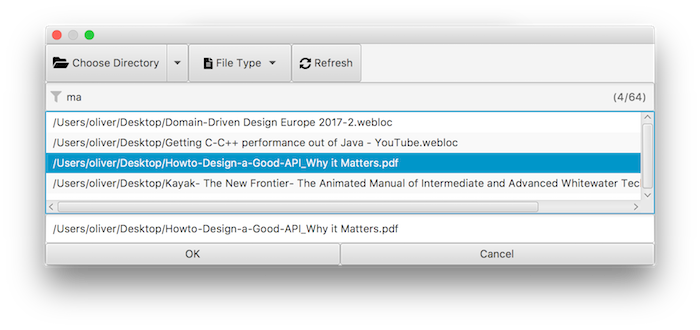

# FXFileChooser (0.0.1)

As the standard JavaFX file chooser uses system dialogs, so it is hard to test and it is not easy to modifiy (e. g. new Skin). In some cases the system controls even show poor performance opening folders with many files (depends on operating system and JRE version).

On Microsoft Windows platforms running with Java 8, I've encountered cases where it was impossible to use the Java Swing JFileChooser, simply due to the high number of files in a directory. Using the JavaFX FileChooser was also not an option as I required a simplistic way to filter the files by name.


## How it works

FXFileChooser provides access to a DirectoryChooser and a ListView populated with files in the selected directory. The process starts in the users home directory. The ListView is populated by a background service running an update task upon request. 

Once the ListView is populated with Path items, those are filtered by the String entered in the filter TextField. The filter condition is "contains" whereas special characters such as '"','?','<','>','|',':','*' are removed.


## Available versions

 * FileChooser placed in a customized JavaFX stage
 * One placed in a JavaFX dialog
 * One placed in a JFXPanel so it can be used in Java Swing applications.


## Features & Ideas
 
 * FXFileChooser is based on FXML and CSS and so fully customizable (the ListView might be replaced by a TableView to have more options in terms of sorting - or it will be completely exchangeable - I'll see)
 * Icons are realized as SVGPaths based upon FontAwesome Free 5 (no glyphs, no extra dependencies, the SVGPaths are part of the FXML)
 * The choose directory button provides a menu, where default locations (or a history of locations) can be provided. **(tbd.)**
 *  File types can be selected from filters **(tbd.)**
 
  


**Ideas**
 * A nice build script.
 * A great skin (CSS) is desirable (well I just got inspired by https://github.com/angelicalleite/museuid and will see :-).


Tests are missing and currently I'm playing with TestFX - but it's not yet working as I like it.


## Using the FileChooser with Swing

```java
    JButton showDialog = new JButton("Show Dialog");
    SwingFileChooser fileChooser = SwingFileChooser.create(200_000);
    showDialog.addActionListener(l -> {
        int option = fileChooser.showOpenDialog(frame);
        
        System.out.println(option);
        if (option == SwingFileChooser.APPROVE_OPTION) {
            System.out.println(fileChooser.getSelectedFile().toString());
        } 
    });
```


## Using the JavaFX Dialog version

```java
	FXFileChooserDialog fc = FXFileChooserDialog.create();
    
    Button showDialog = new Button("Show Dialog");
    showDialog.setOnAction(a -> {
        try {
            Optional<Path> path = fc.showOpenDialog(primaryStage);
            System.out.println(path.map(String::valueOf).orElse("Nothing selected"));
            
        } catch (IOException e) {
            // don't mind 
        }
    });
```


## A version with a completely customizable stage

```java
    PathFilter xmlOnly = PathFilter.create(".xml", p->p.getFileName().endsWith(".xml"));
    FXFileChooserImpl fc = FXFileChooserImpl.create(xmlOnly);
    
    Button button = new Button("Show Dialog");
    button.setOnAction(e -> {
        Optional<Path> selection = fc.showOpenDialog(arg0);
        selection.map(String::valueOf).ifPresent(System.out::println);
        System.out.println("Result is present: " + selection.isPresent());
    });
    
    Scene mainScene = new Scene(button);
```
On OSX this looks as follows:



## Example with running process

In cases with many files, the background activity of listing all files is indicated. Aside a label shows the number of currently filtered files and total available files.

The activity is implemented as a Service so it can be cancelled.

```java 
final class FileUpdateService extends javafx.concurrent.Service<Void> {

    ObservableList<Path> pathsToUpdate
    
    @Override
    protected Task<Void> createTask() {
        return new FindFilesTask(rootFolder.getValue(), pathsToUpdate);
    }
}
```

The FindFilesTask so far only lists files matching the Predicate<Path> `Files::isRegularFile`.


